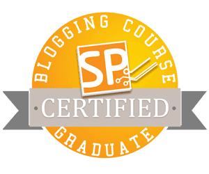

Here I am, finally writing the first blog post for my new blog. I’ve managed to sit down and [do the hard work - without any excuses](http://lifehacker.com/5972825/inspiration-is-for-amateurs--the-rest-of-us-just-show-up-and-get-to-work).

It’s been nine months since I bought a copy of John Sonmez’s book [Soft Skills: The software developer's life manual](https://www.amazon.com/gp/product/1617292397/ref=as_li_tl?ie=UTF8&camp=1789&creative=9325&creativeASIN=1617292397&linkCode=as2&tag=jumarkocuriou-20&linkId=81bc42d9c4c392a2a84b61b87a400b80). However, I didn’t get to read it for quite a while. Do you have the same problem with constantly buying new books without actually reading them? Yet the book was there, waiting on a shelf and attracting my attention from time to time.

Eventually, when we returned home from our best-in-a-whole-life 3-month USA road trip, I decided to give it a shot. The forewords by Uncle Bob and Scott Hanselman gave me a confidence that it would be a good read.

While I'd already had a brief overview of some of the topics covered in the book, it was this book that made me **take an action**.

By the time I’d finished chapters in part one and two, I’d already made the decision: _I’ll start a new blog focusing on my current passions and interests_. _And this time I’ll keep posting new content on a regular basis._

I had a blog ([outofsingularity.wordpress.com](http://outofsingularity.wordpress.com)) for quite a while, but I wasn’t consistent at all. Quite the opposite: I added only one new post for the last 4 years! I had many ideas for blog posts, but I never found enough time to write them down.

Inspired by John’s book I started looking for some advice how to create a successful blog. In no time, I found his free email course [How to Create a Blog to Boost Your Career](https://simpleprogrammer.com/confirm/create-blog-boosts-career/). I signed up…

## Lesson 0: A blog that boosts your career

Having a blog can boost your career in many ways, for instance:

- Getting a better, higher paying job
- Getting more freelancing clients and/or rates
- Learning things by teaching them to others, thus making stronger neural connections and increasing your understanding of a material

There’s a great video _[How Taiseer Joudeh Created a Wildly Popular Blog in 14 Months](https://www.youtube.com/watch?v=-2WZco-8P4c&__s=uqq83mhvo7sjtapzqajq)_ in which Taiseer shares many key points how to make a successful blog:

- You need to specialize
- Write because you’re passionate about the topic and don’t expect anything in return
- Try to explain complex topics in a simple way
- Be yourself
- Be consistent - especially at the beginning
- Be kind, friendly and patient with anyone commenting on your blog posts
- Cross post to other sites like [http://www.codeproject.com/](http://www.codeproject.com/) or [https://dzone.com/](https://dzone.com/)
- Use social media (especially Twitter) for sharing your ideas
- Think of basics of SEO
- Buy your domain at the beginning

That’s a lot of stuff, right? Let’s do it step-by-step!

## Lesson 1: The Most Important Thing For a Successful Blog

**Choosing a Theme** (what the blog is about) is the most important step. Choose your specialization: something you already know well or you would like to know. “Be a Big Fish in a small pond" - try to choose a theme that is as narrow as possible.

For me, this step wasn’t easy. I have many passions and I love reading about lots of different things. My mind kept telling me: “I don’t want to specialize. Generalization is a good thing!”

The problem with this approach is that it’s both hard to do and hard to sell:

1. You can’t be an expert or sufficiently proficient in so many areas. Neither you should focus on so many different areas at the same time.
2. There are so many specialized blogs/books/podcasts that would cover the material better.

I’ve had a passion for Learning & Self-improvement for a long time. I’ve also been very interested in Clojure for last year or so.

I decided to combine these two passions and create [_Curious (Clojure) Programmer_](https://curiousprogrammer.net/about/) blog.

## Lesson 2: Creating Your Blog

This actually wasn’t that hard but required a little time to evaluate different alternatives and pick up the final domain name\*. I decided to go with SiteGround [CuriousProgrammer.net](http://CuriousProgrammer.net) and SiteGround for blog hosting. I chose _SiteGround_ over _BlueHost_ due to the following reasons:

- better uptime
- quick response time
- excellent support

Check out [SiteGround vs BlueHost | Which is the best hosting?](https://inlinehostblogger.com/siteground-vs-bluehost/) for more information.

You can also find ratings for different web hosting providers at [webhostinggeeks](https://webhostinggeeks.com/providers/), e.g.:

- [SiteGround](https://webhostinggeeks.com/providers/siteground)
- [BlueHost](https://webhostinggeeks.com/providers/bluehost)

_\*It’s quite important to have a top-level domain name. My old blog has free “wordpress.com” subdomain but it doesn't look very good: [outofsingularity.wordpress.com](http://outofsingularity.wordpress.com)_

## Lesson 3: Brainstorming Blog Post Ideas

This wasn’t completely new to me. I’d already had some ideas in my Evernote “Blog - ideas” note. However, there weren’t so many of them and most of those were pretty unrelated to the theme of my new blog. As a result, I had to start over:

- As John suggests, I brainstormed 50+ (actually 70) ideas and write them down. It took more than 1 hour, but it was worth the time spent.
- Then I selected the top 15 ideas.
- Then I narrowed down the selection to the top 5 ideas.

I didn’t select the top 3 ideas, but I considered the top 5 to be good enough so I stopped there.

If you are stuck with this step, John provides a list of possible “blog post type” ideas, for example:

- Tutorials and How-To’s
- Book and Product reviews
- Interesting stories about your life related to your theme
- List of Things: “Top 10 ways to …”, “My 7 favorite …”, ...
- Multi-part series posts (larger topics)

So I ended up with the following list:

1. How/Why I did  start my blog?
    - Post about John’s course and my motivation to start blog
2. Why do I want to learn Clojure/ClojureScript?
3. Top 10 resources for learning Clojure/ClojureScript
4. My Clojure learning strategy
5. Status.im and Ethereum for Dummies
    - Status.im is the Open-Source project which I’m currently focusing on.

I might shuffle this list a little bit when the time to write a new post comes but it’s there and I have plenty of topics to start with.

## Lesson 4: Time to Get Serious

**Consistency**: there’s nothing more important to make your blog successful. There are two main reasons:

1. Consistency over time builds a large collection of blog posts each of which has the potential to draw a traffic to your blog.
2. Consistency over time will improve your writing and communication skills in general. If you write consistently you’ll improve.

Thus, in order to be successful, you need to understand how important consistency is and then create a schedule (fixed day and time) for writing a new blog post.

Try to write a new post at least once a week. Especially at the beginning, it’s very beneficial to write 2-3 posts per week. Anyway, this is not something I can commit to, therefore I’ll stick with one post a week. As regards to the schedule, my current plan is to write a new blog post on Mondays and see how it works. Eventually, I might switch to Fridays or weekends if it better suits me.

## Lesson 5: How to Get Traffic to Your Blog?

A good way to start is commenting on other blogs. You can reference your own blog post if it’s related to the topic. But **always** **seek to add a value.** Over time, if you have good content, the majority of traffic will start flowing from search engines.

**That’s it!** This is how I started my new blog and my strategy for consistently writing new posts.

**How about you?** Do you already have a blog? How often do you post new content? Once a week? Once a month? Once a year? Perhaps, you write few blog posts in a short burst when you have time and energy and then let [The Rule of Silence](http://www.linfo.org/rule_of_silence.html) do its job?

If you don’t have a blog yet or are struggling to keep it updated go ahead and sign up for [John’s email course](https://simpleprogrammer.com/confirm/create-blog-boosts-career/). It’s free and it’ll definitely help you to boost your career.

​
