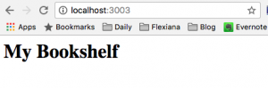

_In the [last post](https://curiousprogrammer.net/2017/02/15/my-clojure-learning-strategy/), I discussed my Clojure learning strategy in general and introduced my new hobby project My Bookshelf._

_This is the very first post in the My Bookshelf series in which I'll describe how to create a skeleton of a simple Clojure web application based on [Luminus template](http://www.luminusweb.net/)._

## Getting Started

When I presented [My Clojure Learning Strategy](https://curiousprogrammer.net/2017/02/15/my-clojure-learning-strategy/), I mentioned the importance of practical experience and learning just enough to get started. This is exactly what [Step 7 of 10-step learning process is about](https://curiousprogrammer.net/2017/02/15/my-clojure-learning-strategy/#step7).

As a preparation, I read the first chapter in [Web Development with Clojure, 2nd ed.](http://amzn.to/2lK9liF) This was more than enough to get ready for creating a new project for _My Bookshelf._

### Tools

To be able to generate the project skeleton with Luminus template you need Java JDK and [Leiningen](https://leiningen.org/).

I installed [Leiningen via brew](https://github.com/technomancy/leiningen/wiki/Packaging):

`brew install leiningen`

You'll also need to install a database of your choice. I chose PostgreSQL:

\# install PostgreSQL
brew install postgresql
# Run PostgreSQL as a service whenever the computer is started.
brew services start postgresql

After that, you're ready to go.

## Generate a Project Skeleton

Luminus is a [handy template](https://github.com/luminus-framework/luminus-template) providing an opinionated selection of high-quality Clojure libraries. It's really useful for beginners. It'll save you plenty of time and a terrible headache which you'd get trying to explore all available Clojure web development libraries.

Having that said, it's trivial to create a new project:

`lein new luminus my-bookshelf +postgres`

We've just generated simple web app using the _+postgres_ switch which instructs Luminus to add PostgreSQL dependencies and generate _db.core_ namespace.

You can, of course, select another database if you want. You'll find the list of many possible options in [_Application Profiles_ documentation](http://www.luminusweb.net/docs/profiles.md)_._

## Set Up a Database

To be able to connect to the database you need to perform an initial setup:

- create a database user for your application
- create a database itself

Both these steps are trivial with PostgreSQL. Run following commands in a shell:

\# creates a new user 'bookworm' which will be used by our application to connect to the DB
createuser --createdb bookworm

# create 2 databases - one for development, another one for testing
createdb -O bookworm my\_bookshelf\_dev
createdb -O bookworm my\_bookshelf\_test

### DB config

Database connection info is stored in _profiles.clj_ in project root directory. This file is automatically generated by luminus template and contains database url for dev and test profiles:

{:profiles/dev  {:env {:database-url "jdbc:postgresql://localhost/my\_bookshelf\_dev?user=bookworm&password=password"}}
 :profiles/test {:env {:database-url "jdbc:postgresql://localhost/my\_bookshelf\_test?user=bookworm&password=password"}}}

The database url can always be overriden via _DATABASE\_URL_ environment variable.

### Migrate the Database

Luminus uses [Migratus](https://github.com/yogthos/migratus) library for handling database migrations.

To migrate the database just run the following command:

lein migratus migrate

Migratus will scan the _resources/migrations_ directory and look for the _.sql_ files which have to follow naming convention `^(\d+)-([^\.]+)\.(up|down)\.sql`

In our case, it'll find the _20170218124009-add-books-table.up.sql_ file and execute the SQL found there:

CREATE TABLE books
(id VARCHAR(20) PRIMARY KEY,
 title VARCHAR(30),
 author VARCHAR(60),
 issued DATE,
 status VARCHAR(30));

Note: If you leave the password in _profiles.clj_ blank (_"_jdbc_:_postgresql_://localhost/my\_bookshelf\_dev?user=bookworm&password=password"_) you'll get an obscure error when trying to migrate the database:

2017-03-07 09:37:12,682 \[main\] ERROR migratus.database - Error creating DB connection for postgresql://localhost/my\_bookshelf\_dev?user=bookworm&password=
java.lang.IllegalArgumentException: Vector arg to map conj must be a pair
        at clojure.lang.ATransientMap.conj(ATransientMap.java:37) ~\[clojure-1.8.0.jar:na\]
...
        at clojure.java.jdbc$parse\_properties\_uri.invokeStatic(jdbc.clj:178) ~\[na:na\]
...
        at migratus.database.Database.connect(database.clj:338) \[na:na\]
...
2017-03-07 09:37:12,683 \[main\] INFO  migratus.core - Ending migrations
Exception in thread "main" java.lang.NullPointerException, compiling:(/private/var/folders/hn/tgwyrdmj1tb5pmmbdkd1g\_qc0000gn/T/form-init7084456921097733207.clj:1:125)
...
Caused by: java.lang.NullPointerException
        at migratus.database$connect\_STAR\_.invokeStatic(database.clj:223)
        at migratus.database$connect\_STAR\_.invoke(database.clj:217)
        at migratus.database.Database.connect(database.clj:338)
        ...

So make sure that some password is set.

## Run the Application

Now we are ready to run our application skeleton. Go to the terminal and execute lein run.

This will compile the application and start an embedded web server listening on port 3000.

### Configure a Different Port For a Web Application

Since many Clojure web applications use port 3000 by default, it can be useful to change the port to another one if you want to avoid conflicts.

For instance, I use the port 3003. You can change this setting in [_config.edn_ file](https://github.com/jumarko/my-bookshelf/blob/01-skeleton/env/dev/resources/config.edn#L2).

### Add a Simple Welcome page

As a first step, we just want to modify the main page to show a title of our shiny new web application.

To make it easy, we'll use _[Hiccup](http://www.luminusweb.net/docs/html_templating.md#html_templating_using_hiccup)_ to generate HTML on a server:

(defn render-home \[books\]
  (hiccup.core/html
    \[:body \[:h1 "My Bookshelf"\]\]))

Notice, that we ignore the input argument _books_ for now. We just want to show a static text.

Now run the application (if you haven't run it already) and open the main page in a browser:

## Conclusion

That's it!

We managed to generate a skeleton for a new Clojure web application, set up a PostgreSQL database and display our first primitive HTML page rendered by _Hiccup._

In the next post, we'll add a basic functionality like showing the list of books to the user.

### Source code

You can find complete source code for _My Bookshelf_ [in master branch](https://github.com/jumarko/my-bookshelf). Beware that this is the latest version and it might be confusing to use it while reading this article.

The version corresponding to this post is tagged (git tag) as [_01-skeleton_](https://github.com/jumarko/my-bookshelf/tree/01-skeleton) and you can find it in [Releases tab on GitHub](https://github.com/jumarko/my-bookshelf/releases/tag/01-skeleton).
