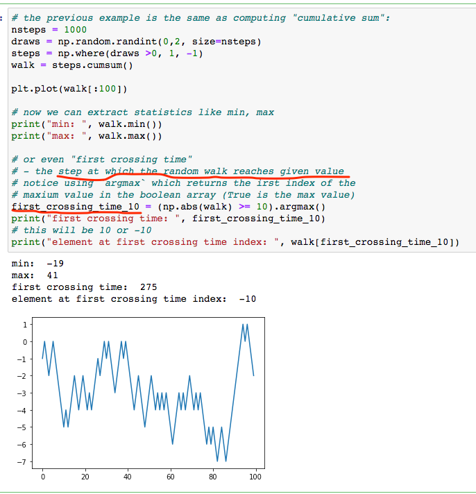
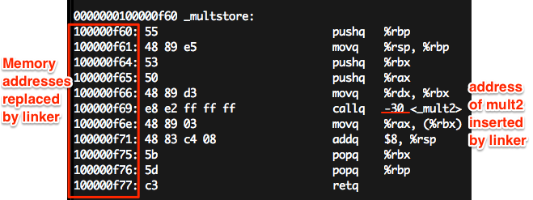
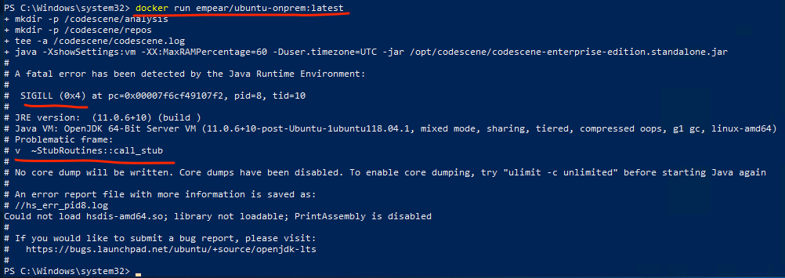
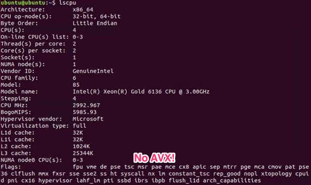
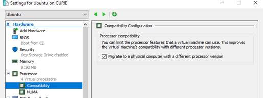

# Weekly Bits & Pieces 01/2020

_This is the very first weekly summary published on my blog. 
It reviews interesting stuff I did and found in the past week_.

<!-- markdown-toc start - Don't edit this section. Run M-x markdown-toc-refresh-toc -->
**Table of Contents**

- [Clojure](#clojure)
- [Learning](#learning)
    - [Rapid Learner](#rapid-learner)
- [Reading](#reading)
- [Writing](#writing)
- [Personal (Hobbies)](#personal-hobbies)
- [Projects Update](#projects-update)
    - [Python for Data Science](#python-for-data-science)
    - [SICP](#sicp)
    - [Computer Systems](#computer-systems)
- [Work (CodeScene)](#work-codescene)
    - [CodeScene 4.0](#codescene-40)
    - [JVM crash and slow analyses](#jvm-crash-and-slow-analyses)
       - [Windows Server - Linux VM and JVM bug](#windows-server---linux-vm-and-jvm-bug)
       - [Windows Server - Tomcat and small heap size](#windows-server---tomcat-and-small-heap-size)
       - [Azure Containers - (really) slow IO](#azure-containers---really-slow-io)

<!-- markdown-toc end -->


<div id="clojure"></div>

## Clojure

I found two interesting pieces on Clojurians slack:

* hiredman's `for` example ("swiss army knife") showing how to navigate nested data (even using a recursive function)
```
(for [maybe-x (tree-seq map? :content xml)
      :when (= (:tag maybe-x) :x)
      maybe-y (:content maybe-x)
      :when (= (:tag maybe-y) :y)
      ,,,
      ]
  whatever)
  
;; you can even do recursive queries with it by just wrapping it in a recursive function 
(fn f [whatever] (for [x whatever i (f x)] i))
```
* #off-topic discussion about **Clojure and teams productivity** (Alex Miller) - I was astonished
   when I found **there are only 4 people doing all the development on Clojure, Datomic** et al.
   > there are only 4 people doing all of the dev on Datomic, Clojure, etc combined so we are a tiny team of very experienced people using high leverage tools. I'm not sure this is directly relevant to most software teams in general (but Clojure projects do probably tend to be more that, and less big teams)

   > Mythical man month is really from the perspective of someone working on teams of like 50-100 people, which is a totally different world

   > no matter how big your team is, the important thing is to connect what people are doing with business value. as team size gets bigger, you inevitably are going to spend a lot more time communicating what to do and what has been done, which is inherently less efficient. So bigger teams need to put in more active effort to optimize that communication flow.

   > Tools like Clojure and Datomic are designed to let a small team get higher leverage and do more with less, both in initial development AND over time as requirements and software changes (caring about this latter bit is imo something Rich pays way more attention to than most), which lets you stay small and avoid taking the efficiency hit in scaling longer than other tools.

I was also surprised by a big performance difference betwee NumPy's array operations
vs Clojure - see [Python for Data Science](#python-for-data-science) for more details


<div id="learning"></div>

## Learning

<div id="rapid-learner"></div>

### Rapid Learner

I've been very curious about general learning strategies for a long time.
A few years ago, I purchased the [Rapid Learner course by Scott Young](https://www.scotthyoung.com/courses/course/rapid-learner/).
I've never managed to finish it although I adopted a few ideas from the course.
A couple of weeks ago, I decided to restart the course (which now has a lot of new content marketed as "Rapid Learner 2.0").

The ideas of **practice** and **directness** are the core concepts in the course 
and it's focus is on practical projects. Thus I'm trying to apply the ideas while going through
the [Python for Data Science](#python-for-data-science) project.


<div id="reading"></div>

## Reading

I always liked reading - it was my passion since grammar school.
Today I read mostly non-fiction books with heavy focus on programming-related topics.

I finished a wonderful practical book about networking called 
[Networking for System Administrators](https://www.amazon.com/Networking-Systems-Administrators-Mastery-Book-ebook/dp/B00STLTH74).
I'll post more details on [Book summaries](https://curiousprogrammer.net/book-summaries/) soon.

Recently, I've enjoyed reading [Shape Up](https://basecamp.com/shapeup) by Ryan Singer from Basecamp
and [On Writing Well](https://www.amazon.com/Writing-Well-Classic-Guide-Nonfiction/dp/0060891548)
by William Zinsser.
Both are great books and I'll tell you more about them soon.

Finally, you can check [my goodreads profile](https://www.goodreads.com/user/show/61742630-juraj-martinka)
to find more books I've read or plan to read.


<div id="writing"></div>

## Writing 

Writing is a great exercise for a programmer - it forces you to clear your thoughts
and it's similar, in many aspects, to coding.

It's been my hope that I can learn and improve this skill ever since I started the 
[curiousprogrammer.net blog](https://curiousprogrammer.net/about/).
I've been dormant for a while but now, armed with a few tips from [On Writting Well](#reading), 
I'm going to post new content more regularly.
[Weekly Bits & Pieces](https://curiousprogrammer.net/weekly-bits-pieces/) are the most recent
addition.


<div id="personal-hobbies"></div>

## Personal (Hobbies)

After a long break caused by COVID-19, we finally managed to do some rock climbing (not just bouldering)
in Moravian Karst, Sloup (near Brno).
It was fun despite a quite specific type of climbing (_very_ polished) :).

<div id="projects-update"></div>

## Projects Update

<div id="python-for-data-science"></div>

### Python for Data Science

I've decided to learn some Data Science using Python.
I'm loosely following the curriculum outlined in 
[How to Learn Python for Data Science the Right Way](https://www.kdnuggets.com/2019/06/python-data-science-right-way.html).
Python is a new language for me (excluding an old short-term experience), 
so the [Python for Data Analysis book](https://www.oreilly.com/library/view/python-for-data/9781491957653)
seems to be a great fit.

Last week I finished Chapter 4 about [**NumPy**](https://numpy.org/):

* It's a common low-level library for fast array computation - implemented in C and using
  "vectorized" functions operating on whole arrays instead of element-wise (like pure python)
* I learned about _Slicing_, _Boolean indexing_, _Multi-dimensional arrays_, and _Random walks_
  among other things. 
* I was amazed by the performance difference between Python (2-3 ms) and Clojure (13-14 ms)
  when multiplying an array of 1,000,000 elements by 2:
```
;;; Python => 22.8 ms for 10 iterations of 1,000,000 elements => 2-3 ms for a single iteration
import numpy as np

my_arr = np.arange(1000000)
my_list = list(range(1000000))

%time for _ in range(10): my_arr2 = my_arr * 2
CPU times: user 14.5 ms, sys: 8.33 ms, total: 22.8 ms
Wall time: 22.8 ms

;;; Clojure - vectors & arrays => ~13 ms at best using plain arrays
(def my-array (int-array (range 1000000)))
(time
 (dotimes [i 10]
   (amap ^ints my-array
         idx
         ret
         (* (int 2) (aget ^ints my-array idx)))))
"Elapsed time: 133.522233 msecs"

;; use also criterium for more objective measurement
(require '[criterium.core :as crit])
(crit/quick-bench (amap ^ints my-array
                        idx
                        ret
                        (* (int 2) (aget ^ints my-array idx))))
;; Evaluation count : 48 in 6 samples of 8 calls.
;; Execution time mean : 14.022060 ms
;; Execution time std-deviation : 476.098590 µs
;; Execution time lower quantile : 13.728450 ms ( 2.5%)
;; Execution time upper quantile : 14.807910 ms (97.5%)
;; Overhead used : 8.025814 ns
```
* _Random Walk_ example in section 4.7 was pretty interesting - I don't think I ever heard
  about _first crossing time_ value:
  - 
  - 

<div id="sicp"></div>

### SICP

I've been reading [Structure and Interpretation of Computer Programs](https://mitpress.mit.edu/sites/default/files/sicp/full-text/book/book.html) 
for a really long time.
It's a fantastic and challenging book. 
It takes me a lot of time to do the exercises but they are definitly worth it.
I'll keep crawling through the book at my toirtose pace :)

Last week I finished the [Huffman Encoding](https://mitpress.mit.edu/sites/default/files/sicp/full-text/book/book-Z-H-16.html#%_sec_2.3.4)
section - apart from an exercise on how to represent trees
I learned about _prefix codes_ and _variable length encoding_.

You will find all my source code from the book here: <https://github.com/jumarko/clojure-experiments/tree/master/src/clojure_experiments/books/sicp>


<div id="computer-systems"></div>

### Computer Systems

[Computer Systems: A Programmer's Perspective](https://www.amazon.com/Computer-Systems-Programmers-Perspective-Global-ebook/dp/B07V71PHR7/ref=pd_sbs_14_1/130-8492999-1421206?_encoding=UTF8&pd_rd_i=B07V71PHR7&pd_rd_r=ed8e11fb-e5ef-468e-8a46-b165f8f3d182&pd_rd_w=UG6HR&pd_rd_wg=oNLvC&pf_rd_p=d13bb895-21d3-4e96-94a7-553aaae51224&pf_rd_r=9WZHWXSX0QYER6ZFQXZ6&psc=1&refRID=9WZHWXSX0QYER6ZFQXZ6) 
is another great book - this time about lower-level programming, operating systems and machine/assembly language.

I started the chapter 3 _Machine-Level Representation of Programs_ and found it refreshing
after the chapter 2 about machine representation of numbers (which is math-heavy and became boring at some point)


I enjoyed a "disassembling" exercise with `gcc -Og` and `objdump -d` (section 3.2.2)
```
# diassemble object code
gcc -Og -c mstore.c
objdump -d mstore.o

# diassemble executable (object code + linking)
gcc -Og -o prog  main.c mstore.c
objdump -d prog
```

I've also found a striking connection to the Huffman Encoding section in SICP - x86 assembly
is really a _prefix code_!
  - Diassembled object code: `objdump -d mstore.o`  
  
  - Disassembled executable: `objdump -d prog`  
  


You can find my book code examples here: <https://github.com/jumarko/computer-systems>

<div id="work-codescene"></div>

## Work (CodeScene)

I joined company called Empear back in 2017 to work on 
[CodeScene - a unique behavioral code analysis tool](https://empear.com/how-it-works/).
I've been really grateful for that - the team is great, I'm learning a lot every day
and I can use Clojure in my daily work.

<div id="codescene-40"></div>

### CodeScene 4.0

The last week was special because we released a new major version of our enterprise product:
[CodeScene 4.0](https://empear.com/blog/codescene-release-4_0/).
I haven't worked on this release - I'm mostly focusing on [codescene.io](https://codescene.io) -
but my colleagues did a great work in this area.
The new version comes with a completely new more intuitive UI with greater focus on features auto-discovery.
We're looking forward to hearing customers' feedback.

For [codescene.io](https://codescene.io), the "cloud" version of CodeScene, 
we're adding Bitbucket support (today you can only analyze GitHub repositories).
It will be an important step for reaching a wider audience.

If you're interested, you can analyze your public repositories for free 
or [get a paid plan](https://codescene.io/plans) if you want to try it on private projects.
Moreover, if you're a student or a teacher you can get a paid plan for free:

- <https://codescene.io/github-students>
- <https://codescene.io/github-teachers>

<div id="jvm-crash-and-slow-analyses"></div>

### JVM crash and slow analyses

While onboarding a few customers we faced issues with slow analyses.
CodeScene is usually pretty fast (running Linux analysis in ~40 minutes on a Macbook Pro laptop with a solid SSD disk)
but two customers were trying to analyze their big repositories and their analyses were running
for more than one day.

There were three distinct cases:

1. One customer running CodeScene in docker inside a Linux virtual machine hosted on Windows Server 2019
2. The same customer later switching to Tomcat deployment directly on the Windows Server host
3. Another customer using [our docker image](https://hub.docker.com/r/empear/ubuntu-onprem/) 
and deploying CodeScene with Azure Containers

<div id="windows-server---linux-vm-and-jvm-bug"></div>

#### Windows Server - Linux VM and JVM bug

First, they tried to run CodeScene using our docker image and hit a JVM bug right from the start:


As my colleague found, this was due to incorrect detection of AVX instruction family support 
(vectorized processor instructions) in the JVM.
There's an open issue for that: <https://bugs.openjdk.java.net/browse/JDK-8238596>.

Once we identified the root cause the workaround was relatively easy - don't use AVX:

```
docker run -e JAVA_OPTIONS=-XX:UseAVX=0 empear/ubuntu-onprem:latest
```

The AVX instruction support can be verified (on Linux) via `lscpu` - just check the `FLags` section
if there's 'avx' or not:


As we later found, the AVX instruction wasn't supported due to "Compatibility Configuration"
on the Windows Server host which allowed the VMs to be easily migrated between physical hosts:


The customer ended up using Tomcat installed directly on the Host Windows OS, 
but it was a really tricky support case anyway.

<div id="windows-server---tomcat-and-small-heap-size"></div>

#### Windows Server - Tomcat and small heap size

The customer decided to switch from Docker to Tomcat deployment but the analysis was still very slow.
We thought it could be a slow IO issue again, because of dealing with another customer's installation
at the same time (see Azure Containers section below).
But It turned out they were using really fast SAN (Storage Area Network) disk storage.

Eventually, we found the root cause: **small _default_ heap** size set by Tomcat:
although the machine had 32 GB of ram, the default Max heap size set by Tomcat Windows installer
was only about ~250 MB.
After raising the max heap size manually to 12 GB the analysis finished within a hour (they have a huge repository):


<div id="azure-containers---really-slow-io"></div>

#### Azure Containers - (really) slow IO

Another painful experience with slow shared file storage on Azure.
A customer analyzing a huge repository couldn't get the results even after a few days!
The problem is still being investigated, but we believe the issue is shared file storage used
by Azure Containers (and also Azure App Service).

CodeScene is an IO intensive application and needs a fast disk.
Thus any kind of distributed file system makes it very sad.
For these reasons [we don't recommend using Azure Files, AWS EFS et al](https://docs.enterprise.codescene.io/versions/4.0.2/getting-started/deployment-options.html#system-requirements).
I ran CodeScene via Azure App Service the last year and found it **at least 10x slower** on medium-sized
repositories compared to a deployment on a plain Linux VM.

